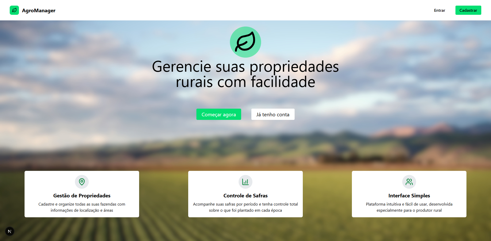
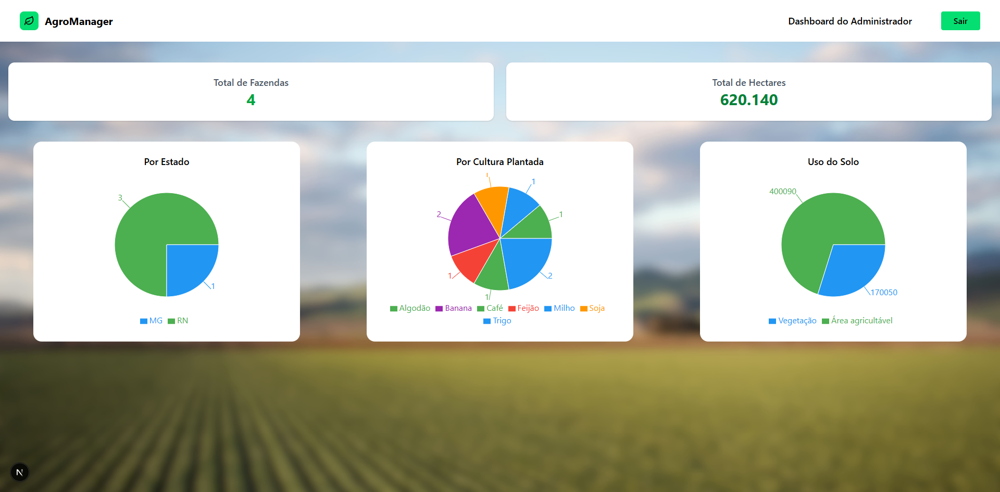
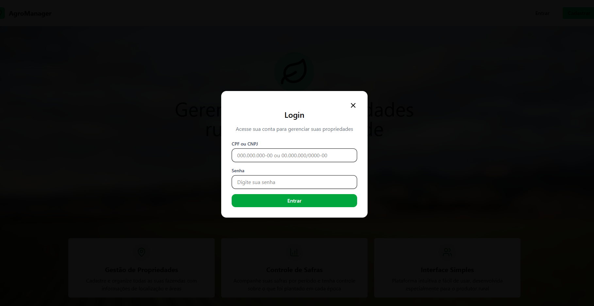
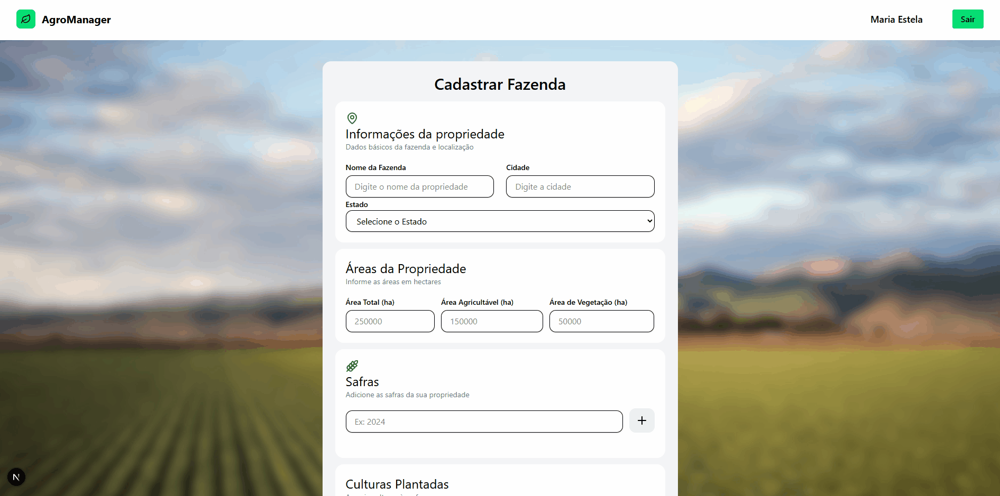

# 🌾 Agro Manager

Plataforma full stack para gestão de propriedades agrícolas, desenvolvida com **NestJS** no backend e **Next.js** no frontend, utilizando **PostgreSQL** como banco de dados. Toda a aplicação foi dockerizada por meio de um `docker-compose`, com serviços para o banco de dados, backend, frontend e também o Prisma Studio.

A proposta do sistema é permitir o cadastro e gerenciamento de produtores rurais e suas respectivas propriedades, com validações específicas para CPF/CNPJ, controle das áreas da fazenda e registro de culturas por safra.

A aplicação utiliza **React Hook Form** para manipulação de formulários, em conjunto com o **Yup** para validação de dados. Também faz uso da biblioteca **cpf-cnpj-validator** para validar documentos e da **Recharts** para exibição de gráficos no dashboard administrativo.

#### O cadastro dos produtores inclui os seguintes dados:

- CPF ou CNPJ  
- Nome do produtor  
- Nome da fazenda (propriedade)  
- Cidade  
- Estado  
- Área total da fazenda (em hectares)  
- Área agricultável (em hectares)  
- Área de vegetação (em hectares)  
- Safras (ex: 2021, 2022)  
- Culturas plantadas (ex: Soja na Safra 2021, Milho na Safra 2021, Café na Safra 2022)

## 🛠 Tecnologias

- 
- 
- 

- 

- 
- 
- 

## ✨ Funcionalidades

- Cadastro e autenticação de usuários.
- Validação do CPF ou CNPJ fornecido pelo usuário.
- Cadastro, edição e exclusão de propriedades. 
- Garante que a soma das áreas agricultável e de vegetação não ultrapasse a área total da fazenda.
- Permite o registro de várias culturas plantadas por fazenda do produtor.
- Um produtor pode estar associado a 0, 1 ou mais propriedades rurais.
- Uma propriedade rural pode ter 0, 1 ou mais culturas plantadas por safra.
 ### 📊 Dashboard da área do administrador que mostra:
- Total de fazendas cadastradas (quantidade).
- Total de hectares registrados (área total).
- Gráficos de pizza:
- Por estado.
- Por cultura plantada.
- Por uso do solo (área agricultável e vegetação).

## 🖥️ Visão geral
### Página inicial
  

 ### Página do administrador

  

 ### Formulário login

  

 ### Formulário de cadastro

 

### Formulário cadastro de fazendas

 

